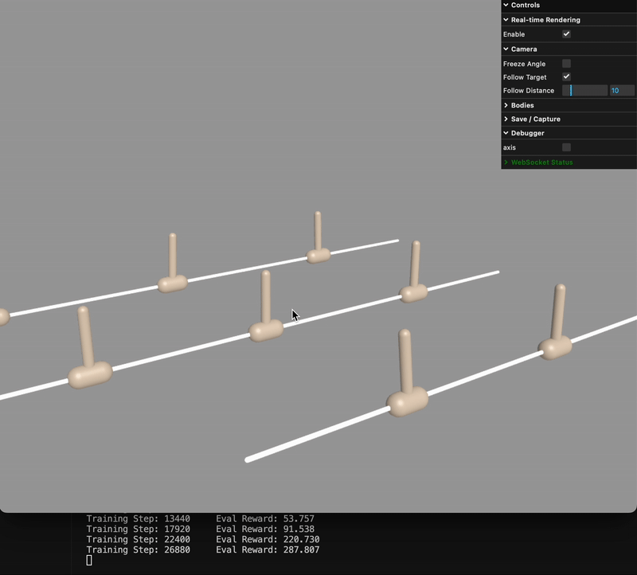
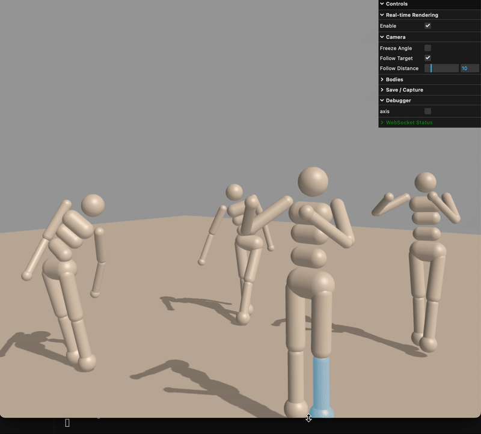
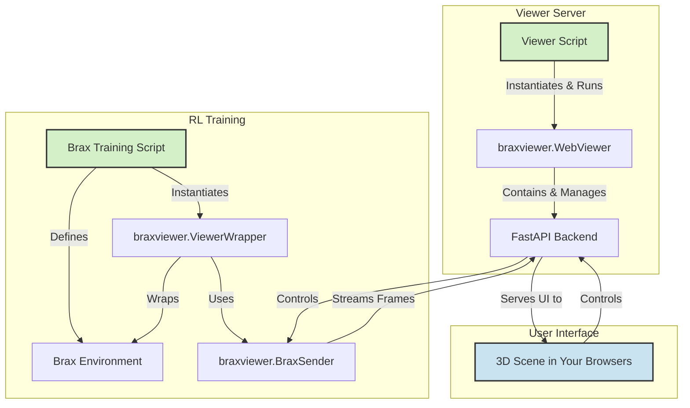

<h1>
  <a href="#"></a>
</h1>

Brax Viewer is a real-time, interactive web viewer for monitoring reinforcement learning (RL) policies during training on Brax, offering an convenient tool for debugging and analyzing the behavior of parallel environments in real-time, while seamlessly integrating into your current workflow.

Architected for JAX's Just-in-time (JIT) compilation paradigm, the viewer visualizes states from JIT-compiled environment and vectorized (vmap) rollouts without breaking the computation flow. It streams data from the Python backend to a web frontend, which is perfect for monitoring remote, headless training sessions with only a web browser. A toggle allows you to pause state synchronization on the fly, minimizing performance impact.

## Demos

<div align="center">
  
  
  
  <br>
  
  <p><em>Visualize training in real-time</em></p>
  <p><em>Toggle rendering on/off anytime</em></p>
</div>

## Key Features

- **Real-time visualization**: Stream Brax environment states in real-time
- **Web-based**: Access visualization from any device with a web browser, perfect for remote headless training
- **JAX-compatible**: Designed to work seamlessly with JAX's JIT compilation with minimal impact on training performance
- **Lightweight**: Depends only on widely used standard packages
- **Interactive controls**: Enable/disable rendering through the web interface to save compute resource on the fly
- **Distributed architecture**: Viewer server runs independently from training process

## Installation and Setup

### Method 1: Install from Git (recommended)

- Single command:

```bash
pip install git+https://github.com/pal-robotics/brax_training_viewer.git
```

### Method 2: Install from source (development)

1. (Optional) create and activate a virtual environment
   - Using conda: `conda create -n your_env python=3.10 && conda activate your_env`
2. Clone the repository

```bash
git clone https://github.com/pal-robotics/brax_training_viewer.git
cd brax_training_viewer
```

3. Install the package in editable mode and its requirements

```bash
pip install -e .
pip install -r requirements.txt
```

4. (Optional) install JAX with hardware acceleration

```bash
pip install -U "jax[cuda12]"
# or
pip install -U "jax[cuda11]"
# or
pip install -U "jax[tpu]"
```

## How to Use


### Quick Start with Examples

The typical workflow involves running the viewer server separately from your training process:

1. Start the viewer server in one terminal
2. Run your training script in another terminal
3. View the visualization in your web browser
```bash
# Start the viewer server in one terminal
python examples/brax/brax_envs/viewer.py

# Run training in another terminal
python examples/brax/brax_envs/train.py

# Open your browser to http://127.0.0.1:8000
```

### Integrate to Your Own Training Script

```python
from braxviewer.BraxSender import BraxSender
from braxviewer.wrapper import ViewerWrapper
from braxviewer.brax.training.agents.ppo import train as ppo

# Create your environment
env = YourBraxEnvironment()

# Create a sender that connects to the already-running viewer server
sender = BraxSender(
    host='127.0.0.1',
    port=8000,
    xml=your_xml_model,
    num_envs=8
)
sender.start()

# Wrap the environment with ViewerWrapper
env_for_training = ViewerWrapper(env=env, sender=sender)

# Start training
make_policy_fn, params, _ = ppo.train(
    environment=env_for_training,
    ...
)

# Stop the sender when done
sender.stop()
```

### Performance Optimization

> **Note**: Streaming state data can slow down training by approximately 8x due to JAX's JIT compilation overhead. We recommend turning off visualization when not actively debugging by using the toggle in the web interface or using:

```python
BraxSender.set_rendering_enabled(False)
```

## Architecture

The viewer uses a distributed architecture with separate components for training and visualization:



## Contributors & Acknowledgements

This project was brought to life during [**Google Summer of Code 2025**](https://summerofcode.withgoogle.com/programs/2025/projects/Xm0toJHl). We are grateful for the support from Google and the open-source community. 

The project is under active development to provide new features for robotics research. Have an idea or found an issue? Please open an [issue](https://github.com/pal-robotics/brax_training_viewer/issues) or submit a [pull request](https://github.com/pal-robotics/brax_training_viewer/pulls), and we’ll add you to the [Contributors](#contributors--acknowledgements) section below.

For development setup and contribution guidelines, see the [Contributing Guide](https://pal-robotics.github.io/brax_training_viewer/contributing.html).


<table>
  <tr>
    <td align="center" style="border: none;">
      <a href="https://github.com/bsyh">
        <br/>
        <sub><b>Shouyue Hu</b></sub>
      </a><br/>
      <sub style="font-size: smaller; color: grey;">Author</sub>
    </td>
    <td align="center" style="border: none;">
      <a href="https://github.com/SergiAcosta">
        <br/>
        <sub><b>Sergi Acosta</b></sub>
      </a><br/>
      <sub style="font-size: smaller; color: grey;">Mentor</sub>
    </td>
    <td align="center" style="border: none;">
      <a href="https://github.com/tomkimsour">
        <br/>
        <sub><b>Thomas Ung</b></sub>
      </a><br/>
      <sub style="font-size: smaller; color: grey;">Mentor</sub>
    </td>
    <td align="center" style="border: none;">
      <a href="https://github.com/OscarMrZ">
        <br/>
        <sub><b>Óscar Martínez</b></sub>
      </a><br/>
      <sub style="font-size: smaller; color: grey;">Mentor</sub>
    </td>
  </tr>
</table>