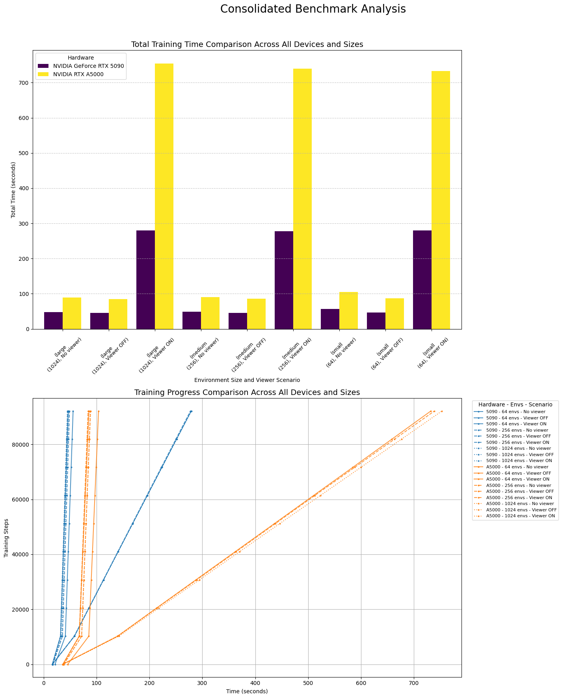

# Humanoid

Viewer Performance Impact Benchmark

## Abstract

Viewer Performance Impact Benchmark
This benchmark quantifies the performance impact of BraxViewer on Brax PPO training speed. We measure training throughput under three scenarios: pure training, viewer backend with rendering disabled, and full real-time visualization.

## Methods

### Experimental Design

We conduct a factorial experiment with three factors:
- **Environment Scale**: 64, 256, and 1024 parallel environments
- **Viewer Configuration**: No viewer, viewer disabled, and viewer enabled
- **Hardware**: Multiple compute devices are tested

### Training Settings

All experiments use identical PPO hyperparameters:
- Environment: `humanoid` with `positional` backend
- Training steps: 50,000
- Episode length: 1,000
- Learning rate: 3e-4
- Entropy cost: 1e-3

### Performance Metrics

Primary metrics include:
- Total training time (seconds) (Figure 1, top)
- Training progress curves (steps vs. time) (Figure 1, bottom)

## Results

*Figure 1: Total training time comparison (top) and training progress curves (bottom) across different hardware configurations, environment scales, and viewer scenarios.*

## Implementation

The benchmark is implemented in `benchmarks/brax/brax_envs/time_envs_device.ipynb`. By running the notebook, the following files are generated.

- `report_{env_name}_{gpu_name}.json`: Hardware specifications and timing results
- `progress_{env_name}_{gpu_name}.csv`: Detailed training progress data
- `consolidated_benchmark_comparison.png`: Visual comparison of all runs