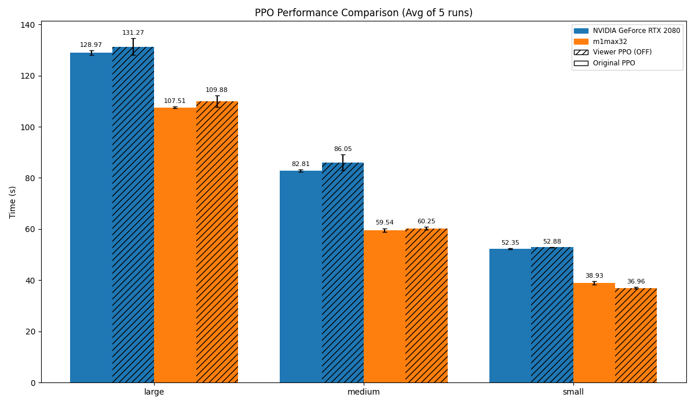

# PPO Performance: Original vs. Modified

## Abstract

This benchmark compares the training speed of the original Brax PPO implementation against a modified version that is integrated with the BraxViewer. The goal is to quantify any performance overhead introduced by the viewer-related code, even when the viewer is not actively rendering.

## Methods

### Experimental Design

The experiment measures the time taken to complete a fixed number of training steps for both the original and the modified PPO implementations. The key variable is the PPO implementation type, while other training parameters are held constant.

- **PPO Implementation**: 
    - **Original**: The unmodified, baseline PPO algorithm from the Brax library.
    - **Modified**: The modified PPO algorithm with viewer integration, but with the visualization disabled.
- **Hardware**: The benchmark is run on multiple hardware configurations to assess performance across different GPUs.

### Training Settings

- **Environment**: `humanoid`
- **Total Timesteps**: 1,000,000
- **Number of environments**: 2048
- **Number of repeated runs**: 5

## Results

The following chart shows the total training time for each PPO implementation across various hardware setups. The bars represent the mean time over 5 runs, and the error bars indicate the standard deviation.

*Figure 1: Comparison of total training time between the original PPO and the viewer-integrated PPO (with viewer disabled) across different hardware.*

## Implementation

The benchmark code is located in `benchmarks/brax/PPO_original_vs_modified/`. 

- `train_original_ppo.py`: Script to run the benchmark for the original PPO.
- `train_viewer_ppo.py`: Script to run the benchmark for the viewer-integrated PPO.
- `plot_results.py`: Script to generate the comparison plots from the JSON results.

Running the training scripts produces `.json` files containing the timing results, which are then used by `plot_results.py` to generate the consolidated performance comparison chart.
