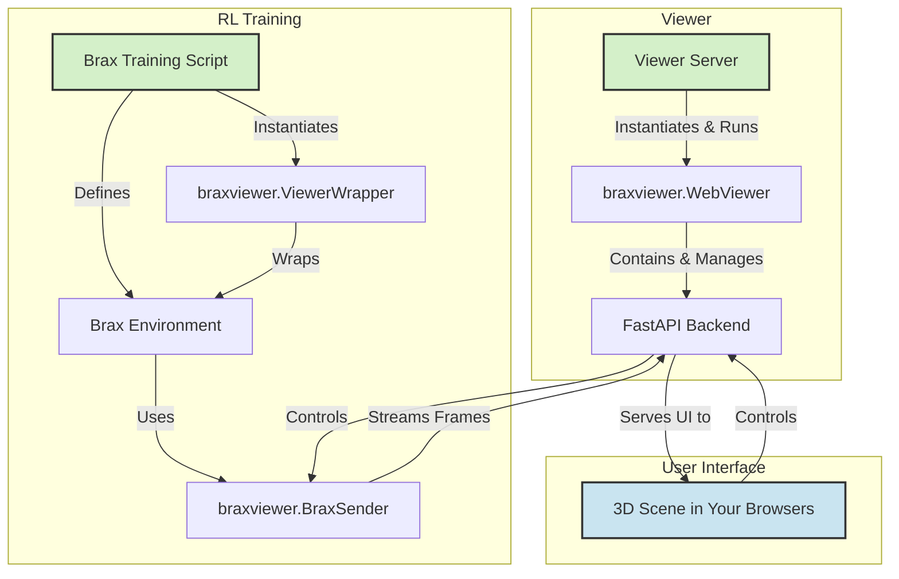

# BraxViewer Architecture

```mermaid
flowchart TD
 subgraph Viewer["Viewer"]
    direction LR
        Launcher[" Viewer Server"]
        Lib_WebViewer["braxviewer.WebViewer"]
        Lib_FastAPI["FastAPI Backend"]
  end
 subgraph Training["RL Training"]
    direction LR
        Training_Script["Brax Training Script"]
        Brax_Env["Brax Environment"]
        Lib_Wrapper["braxviewer.ViewerWrapper"]
        Lib_Sender["braxviewer.BraxSender"]
  end
%%  subgraph subGraph2["Communication Layer"]
%%         Protocol["WebSocket"]
%%   end
    Launcher -- Instantiates & Runs --> Lib_WebViewer
    Lib_WebViewer -- Contains & Manages --> Lib_FastAPI
    Lib_FastAPI -- Serves UI to --> Browser_UI
    Browser_UI -- Controls --> Lib_FastAPI
    Training_Script -- Defines --> Brax_Env
    %% Training_Script -- Instantiates --> Lib_Sender
    Training_Script -- Instantiates --> Lib_Wrapper
    Lib_Wrapper -- Wraps --> Brax_Env
    Brax_Env -- Uses --> Lib_Sender
    Lib_Sender -- Streams Frames--> Lib_FastAPI
    %% Lib_Sender -- Streams Frames --> Protocol
    %% Protocol -- Streams Frames --> Lib_FastAPI
    Lib_FastAPI -- Controls --> Lib_Sender

subgraph subGraph3["User Interface"]
        Browser_UI["3D Scene in Your Browsers"]
  end
    

    style Launcher fill:#d4f0c9,stroke:#333,stroke-width:2px
    style Browser_UI fill:#c9e4f0,stroke:#333,stroke-width:2px
    style Training_Script fill:#d4f0c9,stroke:#333,stroke-width:2px


```